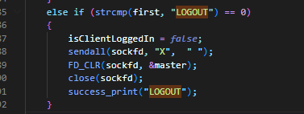


**Text Chat Application**

## COMMANDS:
##  SEND (send)

**Description:**

For the SEND command, we check the validity of the IP and whether it is in the Local Client List. Message has sent to specific client using IP address. If the Client is one of the existing in the local copy of the list of logged-in clients.  Then Messages are sent to the server for RELAY.

[EVENT]: Message Relayed

**Description:**

- All the messages that are exchanged between the clients are passed through the server.

It is handled by the function which is shown in the below snippet on the server end and prints the relayed message as required and the same gets logged into the log file.

**Implementation:**

In the above implementation, In line 607 we are checking whether there is any client present. If client already exists we are relaying message to receiver (i.e line 646) or storing the messages in buffer (i.e 656) based on the login status of the client at line 636.

**Challenges Faced**

- We faced some challenges while reading input during this implementation. Initially we input buffer was limited to 100 characters. So it couldn’t able read the full message.  We overcame it by increasing the input buffer length to 256 characters, gave proper desired output results.

[EVENT]: Message Received

**Description:**

Receiver acknowledges once it receives the message. The message is printed out along with senders IP address. This is handled by the below shown snippet.

**Implementation:**

In this below implementation, Message is received by the client from server.

##  BROADCAST (broadcast)

**Description:**

Broadcast functionality sends message to all logged-in clients. Client sends the message to the server, indicating it is a broadcast. The server then forwards/relays this message to all the currently logged-in clients and stores/buffers the message for the others. It is handled by the below code snippet in left image where client calls sendall function.

When a client wants to broadcast a message, the server here intervenes from code snippet in right image and calls sendall which handles and sends out the messages to all logged-in clients. This message is relayed from the client that initiated the broadcast and the to\_client gets printed out as 255.255.255.255 as per the directions provided in the PA1 Description

**Implementation:**

**Client Side                                                                   Server Side**

##  STATISTICS (statistics)

**Description:**

- When the LIST command is executed, we sort the list of Clients based on the PORT number. Then, the function cse4589\_print\_and\_log is called and it checks for the clients that are logged into the server and prints out the list of clients with the required information about the client’s hostname, IP address, PORT number, and logs into the logged file. (If a client is yet to log in to the server, then we show an ERROR)

- For the STATISTICS command, the logic is similar to List command but we do not check for status of the client.Instead, we print the status using the cse4589\_print\_and\_log function. We also maintain the number of sent and received messages for each client on the server and show that according to the PA1 description. 

**Implementation:**

In this implementation below, At line number 391 we are printing in the required format for all the clients.

##  BLOCK (block)

**Description And Implementation:**

Block all incoming messages (unicast and broadcast) from the client. We maintain a list of blocked clients for each client on the server. Clients are blocked by the server by their Ip address. 

Exception Handling: The function isIPAdressValid checks for the validity of the IP and if the client IP is valid but not logged in then it doesn’t get printed out in the BLOCKED list.

##  BLOCKED (blocked)

**Description And Implementation:**

The blocked command runs on the server side. It displays numbered list of all the clients (see BLOCK command blocked by the client with IP address. printBlockList() method is called to list out all the blocked clients.

** UNBLOCK (unblock)**

**Description And Implementation:**

UNLOCK command unblocks a previously blocked client with IP address. Client IP address is removed from the list of blocked clients by the method removeBlock().

.
##  BUFFER (buffer)

**Description And Implementation:**

- Messages are buffered those are sent to the clients which are logged out. Those messages are relayed when the user logs again. Client's buffered messages are listed in the order they were received at the server. Each of these messages will cause a [EVENT] to occur: Message Received.
- When the server receives messages from a logged out client, it stores the message in the server. When the client logs in, check for any buffered messages for that user, if messages are already buffered, relay those and clear the buffer. This will be used at login and send commands.

**Challenges:**

We also faced challenges to identify the correct order of buffer messages. After sufficient tuning, we were able to identify the correct order.

In this below code snippet server stores messages in buffer for clients who are logged out and not blocked.

##  LOGOUT (logout)

**Description And Implementation:**

Logout commands logouts the particular client from the server but doesn’t exit the client. The client can login to the server whenever needed. It runs on the client side.

In this implementation, server handles Logout of client happening in below code snippet

From client point of view, clients calls sendall with X param to logout as shown below.

##  SEND Exception Handling (exception\_send)

**Description And Implementation:**

Ip address for checked for validation. Ip address is validated and the argv[1] value which is the client ip address is checked to see if it exists in the client list. If the condition is true, then the message is sent to the client ip address. 

##  BLOCK Exception Handling (exception\_block)

**Description And Implementation:**

Client Ip address for checked for validation. Then it is sent to check if it has already been blocked before. If the client ip address is valid and has not been blocked prior, then it is sent to the sendall with below params shown in image, where isClientPresent is checking whether current client is in client list. Finally the last validation is to remove if the ip address has already been blocked. 

##  BLOCKED Exception Handling (exception\_blocked)

**Description And Implementation:**

The function isIPAddressValid checks for the validity of the IP and if the client IP is valid but not logged in then it doesn’t get printed out in the BLOCKED list.

##  UNBLOCK Exception Handling (exception\_unblock)

**Description And Implementation:**

The ip address  sent validated multiple times. It checks the client ip address is a valid or not. It checks if the ip address exists in the client list. Finally the last validation is to check if  the ip address has already been blocked. 

